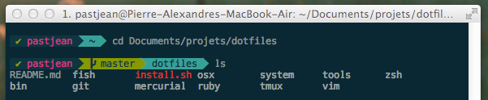

dotfiles
========

Dotfiles is your $CASTLE and you should personalize your $CASTLE how you like it.

Install
-------
    
via `curl` (it's really only a git clone tough)

    curl -L https://raw.github.com/pastjean/dotfiles/master/tools/bootstrap.sh | sh

manual directory specification

    curl -L https://raw.github.com/pastjean/dotfiles/master/tools/bootstrap.sh | DOTFILES_DIR="<the-dir>" sh

OSX Defaults
------------

Setup default OSX preferences

    bash $DOTFILES/osx/defaults

[oh-my-zsh](https://github.com/robbyrussell/oh-my-zsh)
------------------------------------------------------

    curl -L https://github.com/robbyrussell/oh-my-zsh/raw/master/tools/install.sh | sh

How it works
------------

- **bin/**: `bin/` directory will be added to `$PATH`.

- **[topic]/\*.install.sh**: Any file named \*install.sh will get loaded on installation by bash
  of the shell
- **[topic]/\*.fish**: Any files ending in `.fish` gets loaded by fish the shell
- **[topic]/\*.symlink**: Any files ending in `.symlink` get symlinked into
  your `$HOME`. 

thanks
------
- @ryanb http://github.com/ryanb/dotfiles 
- @sjl
- @holman (on topics) https://github.com/holman/dotfiles